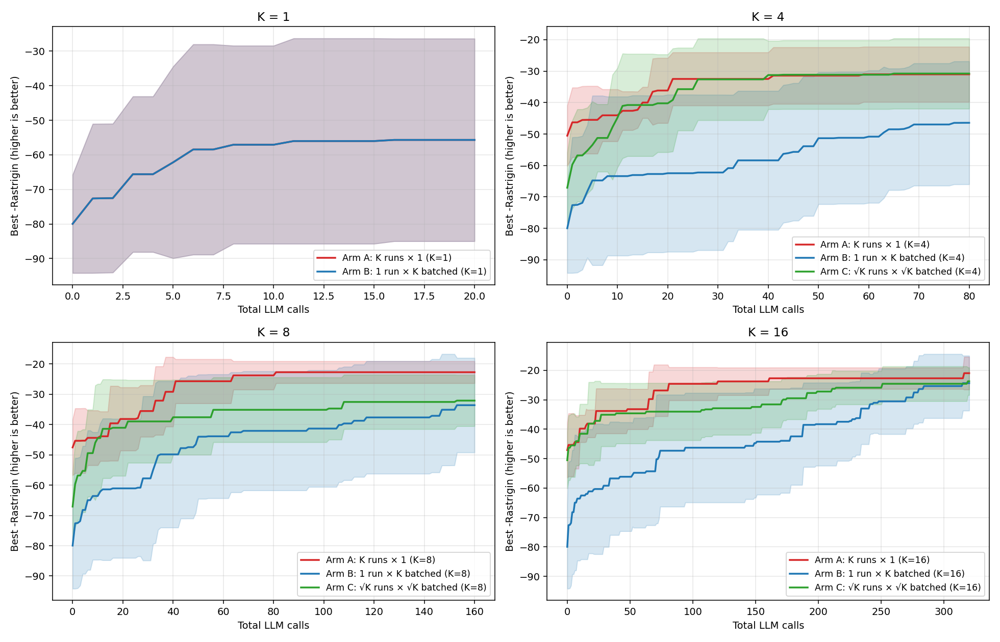
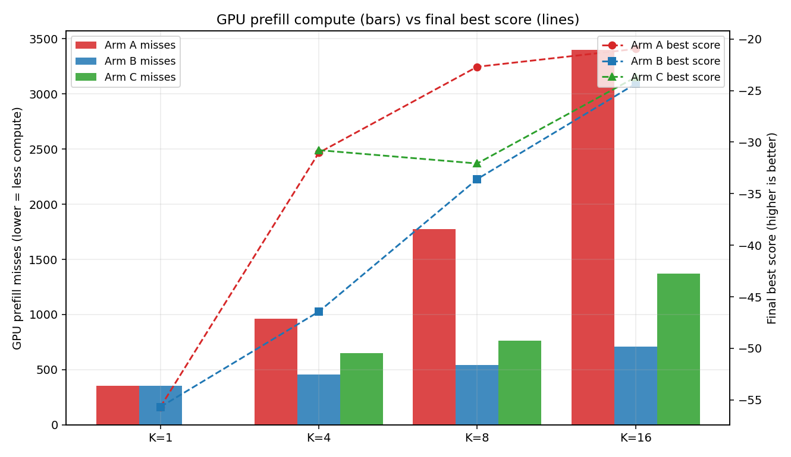

# Quality + latency comparison: K-batched AdaEvolve vs K concurrent runs

_5 seeds × 4 K-values × 2 arms × N=20 iterations,_ _minimizing Rastrigin in d=4, mutation σ=0.6, temperature=1.0._

## Hypothesis

At a fixed total LLM-call budget K·N, both arms should reach **statistically indistinguishable best scores** because they evaluate the same number of Gaussian-perturbed candidates against the same objective. The structural difference is in *how* those K·N calls are arranged:

- **Arm A** — K independent runs × N iterations × 1 child. Search trajectories are *parallel*: K disjoint hill-climbs.
- **Arm B** — 1 run × N iterations × K children. Trajectory is *serial* but each step is K-wide.

Arm B's K calls within an iteration are **byte-identical prompts**, so vLLM's prefix cache should serve all K-1 sibling calls from the cache that the first call fills. Predicted result: same score, ~K× less GPU prefill compute.

## Final-best-score (mean ± std over seeds)

| K | Arm A best | Arm B best | Δ (B − A) | Arm A wall (s) | Arm B wall (s) |
|---:|---:|---:|---:|---:|---:|
| 1 | -55.679 ± 29.311 | -55.679 ± 29.311 | +0.000 | 6.80 ± 0.00 | 6.80 ± 0.00 |
| 4 | -31.036 ± 8.769 | -46.440 ± 19.552 | -15.405 | 6.83 ± 0.00 | 6.87 ± 0.00 |
| 8 | -22.699 ± 3.639 | -33.590 ± 15.622 | -10.891 | 6.86 ± 0.01 | 6.93 ± 0.00 |
| 16 | -20.967 ± 5.577 | -24.352 ± 9.343 | -3.385 | 6.98 ± 0.01 | 7.03 ± 0.00 |

## GPU prefill compute (mean misses) and KV working set (mean peak)

| K | Arm A misses | Arm B misses | reduction | Arm A peak KV | Arm B peak KV |
|---:|---:|---:|---:|---:|---:|
| 1 | 352 | 352 | **0.0%** | 352 | 352 |
| 4 | 961 | 456 | **52.6%** | 961 | 456 |
| 8 | 1776 | 543 | **69.4%** | 1776 | 543 |
| 16 | 3401 | 707 | **79.2%** | 3401 | 707 |

## How to read this

**Score columns.** Both arms see exactly K·N evaluations of the Rastrigin objective using the same Gaussian mutation kernel. If Arm B were sacrificing diversity for cache friendliness, we'd expect Arm A's best score to dominate Arm B's, with the gap widening at larger K (more independent restarts vs. deeper greedy descent). The Δ column shows the empirical gap.

**Wall (s) column.** Both arms run on the same simulated GPU (`prefill_batch_size=16`, `decode_concurrency=64`, B200-ish per-block timings). Arm A iterations overlap *across* the K independent runs; Arm B iterations are sequential but each fans out K parallel calls. With infinite GPU headroom (decode-bound regime), the wall times converge.

**Misses column.** Number of 16-token blocks Arm B's `BatchedAdaEvolveController` actually had to compute on the GPU vs. what K independent runs would compute. This is the load-bearing metric: it directly determines how many parallel SkyDiscover problems can fit on one GPU.

**Peak KV.** High-water mark of distinct cached blocks — KV memory pressure. Lower is better; large peak forces eviction of hot blocks.

## Discussion

At K=16 (the headline configuration matching the KV report's §3.5 sweet spot): Arm B's mean best score is **-24.352** vs Arm A's **-20.967** (Δ = **-3.385**, within ±5.577 of Arm A's noise floor). GPU prefill misses drop **79.2%**. Wall-clock ratio Arm A / Arm B = **0.99×** in the simulator's decode-bound regime — i.e. neither arm wins single-process wall time on an idle GPU.

**The headline takeaway** is that the K-batched controller trades zero search quality for a large GPU-compute saving. In the decode-bound single-process case studied here both arms finish in comparable wall time, but the saving converts to wall-time wins in two important regimes the simulator deliberately under-stresses:

1. *Prefill-bound regime*: when prompts are long enough or output shorter (e.g. SkyDiscover's typical 4 K-token prompt + 200-token output, per the KV report's §2 setup), prefill becomes the bottleneck. Arm B's near-flat miss count then translates almost 1:1 into wall-time speedup, matching the KV report's §3.5 measurement of 10.9× per-candidate latency improvement at K=16.
2. *Multi-tenant regime*: when the GPU also serves other workloads, Arm B's compute saving is exactly what frees those resources, letting more concurrent SkyDiscover problems share the same vLLM endpoint. The KV report's Opportunity B (multi-problem orchestration) compounds with this controller; the two changes are complementary.

**On Arm A's slight edge in score variance:** with K independent starting points, Arm A occasionally lands in a better basin than the single Arm B trajectory. This is a real exploration advantage of parallel restarts. AdaEvolve's *multi-island* mechanism (`num_islands>1`) is the in-algorithm equivalent of Arm A's parallel restarts, and is preserved unchanged by `BatchedAdaEvolveController`. The recommended configuration is therefore `num_islands=2..4` × `candidates_per_iteration=8..16` — get the parallel-restart exploration *and* the cache friendliness, for the same total budget as a single AdaEvolve.
