# Cache-Aware Parallel AdaEvolve: A Systems Study of GPU-Efficient LLM-Guided Evolutionary Search

*Mert Cemri, with Claude assistance.*
*Computer systems exploration on top of SkyDiscover's AdaEvolve algorithm.*
*All experiments performed April 28–30, 2026, on 1× NVIDIA H100 80GB
serving Qwen3-4B-Instruct-2507 via vLLM 0.15.1 with prefix caching
enabled. Mock-vLLM simulator results supplement the real-engine runs
where the workload is hard to construct in a few hours of GPU time.*

---

## Abstract

SkyDiscover is an LLM-guided evolutionary code-discovery framework
in which AdaEvolve, the headline search algorithm, samples a parent
program, asks an LLM to mutate it, evaluates the child, and iterates.
Each iteration today issues exactly one LLM call against vLLM with
prefix caching; on real workloads (the framework's `KV_CACHING_REPORT.md`
measured 17.3 % hit rate) most of the per-iteration prompt churns and
the vLLM cache provides limited value.

This paper studies a stack of seven systems-level optimizations on
top of AdaEvolve, ordered by implementation cost from a 1-week
controller change to a multi-month vLLM internals modification. The
optimizations are: (1) **K-batched candidates per iteration** sharing
one prompt; (2) **adaptive K** keyed off AdaEvolve's exploration-
intensity signal; (3) **speculative iteration pipelining** with
GPU-pressure-aware gating; (4) **multi-problem orchestration** on a
shared vLLM endpoint; (5) **AdaEvolve-aware priority eviction**
overriding vLLM's LRU; (6) **persistent KV across runs** snapshotting
the system prefix; (7) **diff-aware cross-iteration KV reuse** with
RoPE re-application (simulated; the only research-grade item).

We measure each optimization in isolation and stacked, on real vLLM
where possible and on a chained-SHA-256/16-token-block faithful
simulator otherwise. The headline numbers across multiple experiments
on `circle_packing` and `signal_processing` (both file-evaluator
benchmarks from SkyDiscover's math suite):

* **Cache hit rate: 18 % → 94 %** (vanilla → all-optims).
* **Per-call wall-time speedup: 9.8×** at the canonical 2-bench
  cohort, **10.6×** at single-problem N=8.
* **Throughput multiplier under multi-problem orchestration: 1.4×**
  on a single GPU at N=8 concurrent problems (vs vanilla baseline at
  the same N).
* **Search quality preserved**: long N=16 run with full optimization
  stack reaches `circle_packing` score **0.816** (seed 0.364,
  AlphaEvolve target 1.000), confirming the optimizations don't
  trade away search quality.
* **Diff-aware KV reuse (simulated): 47–52 % additional GPU prefill
  reduction** at edit sizes typical for AdaEvolve mutations
  (4–32 tokens).

We also report two **methodological corrections** that changed the
data interpretation by a large factor — they are documented honestly
because we believe they generalize to anyone benchmarking
LLM-guided search systems.

---

## 1. Introduction

### 1.1 Problem context

AdaEvolve, the most sophisticated of SkyDiscover's eight search
algorithms, drives an evolutionary loop: at each iteration it samples
a parent program from a multi-island population (with UCB selection,
adaptive intensity, and migration), asks a large language model
(typically GPT-5 or Qwen3 family) to mutate it, evaluates the child
via a benchmark-specific evaluator, and updates the database.
Iterations are sequential by default; the existing
`max_parallel_iterations` knob runs multiple iterations concurrently
but each still issues one LLM call.

For long-running discovery, the cost is dominated by the LLM step:
each prompt is large (≥ 4 K tokens of evaluator code, framework
instructions, parent code, and search guidance), and the model output
is comparatively short (≤ 200 tokens of code edit). On a vLLM
endpoint with prefix caching, the *static* portion of the prompt
(evaluator code + framework instructions) should hit cache; the
*dynamic* portion (parent code + search guidance) churns every
iteration.

The framework's prior `KV_CACHING_REPORT.md` measured this on a real
B200 deployment: 17.3 % effective cache hit rate on a 30-iteration
run of `circle_packing`. The same report estimated, in passing, that
issuing K identical-prompt calls per iteration (a "GRPO-shaped" group)
would push the hit rate to ~99 % within an iteration. That report
did not turn the estimate into a controller; this paper does.

### 1.2 Research questions

We organize the work around three concrete questions:

1. **Quality.** Does folding K candidate generations into one
   AdaEvolve iteration produce best scores comparable to running K
   independent processes at the same total LLM-call budget? On
   multi-modal landscapes, the parallel-restart vs single-trajectory
   trade-off is not obviously settled.
2. **GPU efficiency.** How much GPU prefill compute does each
   optimization save in isolation, and how do the savings stack?
3. **Wall-time.** Does the saving translate to faster end-to-end
   time, and under what GPU-resource regime?

### 1.3 Contributions

We make four kinds of contributions:

1. A **production-ready controller** — `BatchedAdaEvolveController`
   in the SkyDiscover repo — that implements K-batched candidates,
   adaptive K, speculative pipelining (with GPU-pressure gating),
   and cache-aligned prompt layout. It composes with all of
   AdaEvolve's existing machinery (multi-island, paradigm
   breakthrough, dynamic islands, Pareto mode).
2. A **mock-vLLM simulator** that faithfully models vLLM v0.18's
   chained-SHA-256 16-token-block prefix cache, including
   COMPUTING-state coordination, LRU eviction, optional priority
   eviction, persistent-KV snapshot/restore, and a content-hash
   index for diff-aware reuse. The simulator is used to characterize
   optimizations whose real-engine implementation requires a vLLM
   fork.
3. A **comprehensive set of 11 experiments** spanning real vLLM and
   simulator: cache-only synthetic, multi-arm Rastrigin quality,
   real-vLLM canonical comparison, multi-problem scaling sweep,
   long-run convergence, FP8 KV cache, diff-aware reuse, adversarial
   multi-tenant priority eviction, persistent KV cold start,
   speculation gating, and the per-iteration trace.
4. **Two methodological corrections** that we document explicitly
   because they shifted measured effects by 9× and 71×: a
   simulator-architecture bug (lock vs semaphore) that masked
   COMPUTING-state coordination, and a cache-tagging bug
   (priority by section name vs by intended reuse) that masked
   priority eviction's value.

The goal is not just numbers but a *methodology* — what to measure,
where the gotchas are, how to report — for the next person
optimizing LLM-guided evolutionary search.

---

## 2. Background

### 2.1 vLLM prefix caching primer

vLLM caches per-block KV state, where each block is `block_size`
tokens (16 by default). The cache key is a chained SHA-256:

```
hash_0 = SHA256(0 || tokens_0)
hash_i = SHA256(hash_{i-1} || tokens_i)
```

A request's lookup walks the chain from `hash_0`. The first miss
breaks the chain — every block downstream of the miss must be
prefilled regardless of whether its content matches a previously-
cached block. This is **prefix-only matching**: an edit at token k
invalidates blocks ⌈k/16⌉ through end-of-sequence.

Concurrent requests for the same hashed block are coordinated via
a `COMPUTING` state: the first arrival registers `COMPUTING`, runs
the prefill, and on completion sets `READY` and signals an event;
other concurrent requests for the same hash await the event and
inherit the result with zero GPU work. This is the mechanism that
makes K-batched same-prompt calls cheap.

Eviction is LRU among `READY` blocks, with a tie-break that prefers
deeper blocks (later in the sequence) for eviction since they are
shared across fewer requests.

### 2.2 AdaEvolve primer

AdaEvolve maintains `num_islands` populations of `population_size`
programs each. Each iteration:

1. **Selection.** UCB-driven choice of an island; sample a parent
   from that island's UnifiedArchive (quality-diversity-based
   sampling). The sampling mode (exploration / exploitation /
   balanced) is determined by an adaptive *intensity* signal G,
   which is the EMA-decayed sum of squared improvements on the
   island.
2. **Prompt construction.** `AdaEvolveContextBuilder` composes:
   system message (problem statement + framework instructions);
   user message (parent program + sibling history + search
   guidance + paradigm breakthrough hint).
3. **Generation.** One LLM call against the configured backend.
4. **Parsing.** Diff-block extraction (or full-rewrite), apply
   to parent's solution to get child solution.
5. **Evaluation.** The benchmark's evaluator computes a metric
   dict (with `combined_score`).
6. **Database update.** Add child to current island; possibly
   migrate; possibly trigger paradigm breakthrough on stagnation.

### 2.3 The optimization stack at a glance

| # | Optimization | Tier | Where | Real / Simulated |
|---|---|---|---|---|
| 1 | K-batched candidates | 1.2 | controller | real |
| 2 | Adaptive K | 4.4 | controller | real |
| 3 | Speculative pipelining (+ gating) | 3.2 | controller | real |
| 4 | Cache-aligned prompt | 2.2 | context builder | real |
| 5 | Multi-problem orchestrator | 1.2 | new harness | real |
| 6 | Priority cache eviction | 2.1 | needs vLLM fork | simulated |
| 7 | Persistent KV across runs | 2.3 | needs vLLM fork | simulated |
| 8 | Diff-aware KV reuse | 3.1 | needs vLLM fork | simulated |
| 9 | Streaming prefix prefetch | 4.5 | controller | real |
| 10 | FP8 KV cache | 4.2 | vLLM flag | real |

---

## 3. Approach

### 3.1 The K-batched controller

`BatchedAdaEvolveController` overrides `_run_iteration` so that each
AdaEvolve iteration becomes a K-wide fan-out:

```
parent, ctx        = database.sample()             # ONE sample per iter
prompt             = context_builder(...)          # built ONCE
responses          = await gather([_call_llm(prompt, T_i)
                                    for T_i in K])
parsed             = parse(responses)              # K candidates
metrics            = await gather([eval(c) for c in parsed])
for c in K:        database.add(c, iter)           # K children added
database.end_iteration(iter)                       # tick UCB / migration once
```

Properties:

* The K LLM calls send **byte-identical** `(system, user)` strings,
  so vLLM's chained block hashes match exactly. The first call to
  start prefilling registers each block as `COMPUTING`; the other
  K-1 await the events and inherit KV with zero GPU prefill work.
* Per-call **temperature varies** across the K calls (linear spread
  around the configured base) to keep the K children diverse despite
  the shared prompt. Temperature is a decode-time parameter; it does
  not enter the cache key.
* Database state advances by **K children per iteration** but the
  UCB rotation, migration timer, and paradigm-stagnation tracker tick
  once per iteration, preserving AdaEvolve's original schedule.

### 3.2 Adaptive K

Given the island's intensity G ∈ [`intensity_min`, `intensity_max`],
the effective K for the iteration is

```
t   = (G - intensity_min) / (intensity_max - intensity_min)
K_eff = clip(K_min + (K_max - K_min) * t, K_min, K_max)
```

Low intensity (exploitation) → small K (one focused child is
enough); high intensity (exploration) → large K (broad fan-out).
A second stage scales K down when vLLM's `kv_cache_usage_perc`
exceeds a threshold (be-a-good-neighbor under multi-tenant load).

### 3.3 Speculative iteration pipelining (with GPU-pressure gating)

After iteration t's K LLM calls complete (but before its evaluations
finish), the controller launches a *speculative* fan-out for
iteration t+1's predicted prompt. Two predictors are tried:

1. **Best-so-far parent.** The current best program in the database
   is built into a fresh prompt; iteration t+1, when its `database.sample()`
   returns this parent, picks up the speculative responses and
   skips the LLM gen wall-clock.
2. **Same-as-current.** Fallback: predict the prompt won't change.
   Common under exploitation mode.

**Gating.** The controller polls `vllm:num_requests_running` /
`speculation_max_num_seqs`; if the ratio exceeds
`speculation_pressure_threshold`, it skips speculation. Without
gating, speculation regressed throughput at N=8 concurrent problems
(see §6.4).

### 3.4 Multi-problem orchestration

`real_vllm_bench.py:multi_problem` launches N concurrent AdaEvolve
problems against ONE shared vLLM endpoint via `asyncio.gather`. All
of them benefit from the shared system-prefix cache: at N=8 the
batched arm achieved 90 % hit rate even though the per-problem
parent codes diverge.

### 3.5 Priority eviction (simulated)

The mock simulator extends each block entry with a `priority` field
and tag (`system` / `user` / `parent_island_<i>` / `sibling_iter_<t>`).
With `eviction_policy="priority"`, eviction sorts by `(priority,
last_used_ts)` ascending: lower priority first, then by recency.
Real workloads tag system blocks priority=3, user blocks priority=1.

### 3.6 Persistent KV across runs (simulated)

`MockVLLM.export_warm_blocks(min_priority=3)` snapshots high-priority
blocks at run end; `import_warm_blocks(snap)` reloads them at the
start of the next run with `state=READY`. The next run skips the
cold prefill of any matching block.

### 3.7 Diff-aware cross-iteration KV reuse (simulated)

Alongside the chained block hash, the simulator computes a
**content-only** SHA-256 per block (`content_hash_blocks`). When a
chained miss occurs past the prefix break, the simulator checks the
content index; if found, the KV is borrowed from the previously-
cached block at a `DIFFAWARE_REUSE_BLOCK_US = 16 × 10 µs` cost
(≈ RoPE re-application only) instead of the full
`UNCACHED_BLOCK_US = 16 × 60 µs` prefill.

### 3.8 Cache-aligned prompt layout

`DefaultContextBuilder._maybe_align` pads each prompt section to a
multiple of `4 × block_size` characters (~16 tokens) with whitespace.
This pins per-section block-boundary positions across iterations so
that a section growing/shrinking by a few tokens doesn't shift every
downstream block's hash.

### 3.9 Streaming prefix prefetch

After iter t's K LLM calls fire, the controller launches a
fire-and-forget `max_tokens=1` request against the predicted next
prompt. vLLM does the prefill, caches the blocks, and returns
immediately. When iter t+1's real call arrives, it hits warm cache
without waiting.

### 3.10 FP8 KV cache

vLLM supports `--kv-cache-dtype fp8`, halving the per-block KV
memory footprint at the cost of an "accuracy may drop without a
proper scaling factor" warning. We test it on a separate endpoint
on GPU 1 to compare hit rate, wall time, and quality with default
(bf16) on GPU 0.

---

## 4. Implementation

### 4.1 Code that landed in the SkyDiscover package

* **`skydiscover/search/adaevolve/batched_controller.py`** — the
  full controller (~590 lines). Implements K-batched fan-out,
  adaptive K with intensity- and cache-pressure-driven branches,
  speculative pipelining with two predictors and a class-shared
  metrics cache, prefetch.
* **`skydiscover/search/adaevolve/__init__.py`** — exports
  `BatchedAdaEvolveController`.
* **`skydiscover/search/route.py`** — registers `adaevolve_batched`
  search type (database stays `AdaEvolveDatabase`).
* **`skydiscover/config.py`** — 14 new fields on
  `AdaEvolveDatabaseConfig`:

```yaml
candidates_per_iteration: 1
diversify_temperature: false
temperature_spread: 0.4
adaptive_candidates: false
candidates_min: 2
candidates_max: 16
enable_prefetch: false
cache_aligned_prompt: false
cache_alignment_block_size: 16
enable_speculative_pipelining: false
speculation_gpu_pressure_gating: false
speculation_pressure_threshold: 0.6
speculation_metrics_url: "http://127.0.0.1:8765/metrics"
speculation_max_num_seqs: 32
cache_pressure_adaptive_k: false
cache_pressure_threshold: 0.7
pressure_k_scale: 0.5
```

* **`skydiscover/context_builder/default/builder.py`** — adds
  `_maybe_align()` post-processing hook that pads system and user
  message sections to 16-token boundaries.

### 4.2 Mock simulator and benches

* **`mock_vllm.py`** — single-file in-process simulator with
  chained-SHA-256 hashing, COMPUTING-state coordination, LRU and
  priority eviction, persistent-KV snapshot/restore, content-hash
  index for diff-aware reuse, configurable `prefill_batch_size`
  (continuous batching width) and `decode_concurrency`.
* **`bench.py`** — cache-only synthetic comparison.
* **`quality_bench.py`** — Rastrigin quality bench (3 arms × 4 K's
  × 5 seeds; matplotlib plots).
* **`cache_policy_bench.py`** — priority eviction + persistent KV.
* **`adversarial_eviction_bench.py`** — multi-tenant adversarial
  pattern.
* **`diff_aware_bench.py`** — Tier 3.1 simulation.
* **`real_vllm_bench.py`** — real-vLLM driver with 7 arms.
* **`scaling_sweep.py`** — N-concurrent multi-problem sweep.
* **`fp8_kv_bench.py`** — FP8 vs bf16.
* **`per_iter_trace.py`** — per-iteration `/metrics` snapshot.
* **`make_plots.py`** — generates 11 figures from all CSVs/JSONs.
* **`test_batched_controller.py`** — controller behavioral
  invariants.

---

## 5. Experimental methodology

### 5.1 Hardware

* Node with 8× NVIDIA H100 80GB.
* Two vLLM endpoints concurrently:
  * Port 8765 on GPU 0: default KV dtype, prefix caching enabled,
    `max-num-seqs 32`, `gpu-memory-utilization 0.85`.
  * Port 8766 on GPU 1: same but `--kv-cache-dtype fp8` (FP8 KV).
* The remaining 6 GPUs were idle during all experiments; no
  multi-GPU parallelism was used by SkyDiscover itself.

### 5.2 Model

`Qwen/Qwen3-4B-Instruct-2507`. We initially tried
`Qwen/Qwen3.5-4B` per user request but vLLM 0.15.1 doesn't ship
the `Qwen3_5ForConditionalGeneration` architecture handler yet, so
we fell back to the closest supported Qwen3 variant. All real-vLLM
numbers in this paper use Qwen3-4B-Instruct-2507.

### 5.3 Benchmarks

Two SkyDiscover math benchmarks with file-based evaluators:

1. **`circle_packing`** — pack 26 circles in a unit square,
   maximize sum of radii. Seed program scores 0.364
   (sum-of-radii / 2.635 AlphaEvolve target).
2. **`signal_processing`** — DSP filter coefficient optimization.
   Seed program scores 0.499.

The remaining math benchmarks (`first_autocorr_ineq`,
`second_autocorr_ineq`, `erdos_min_overlap`, etc.) require JAX or
Docker infrastructure we did not configure; they are on the
follow-up list.

### 5.4 Simulator parameters

When the simulator is used:

* `BLOCK_SIZE = 16` (tokens / block — matches vLLM v0.18 default).
* `UNCACHED_BLOCK_US = 16 × 60 = 960 µs` (B200-ish prefill cost).
* `CACHED_BLOCK_US = 16 × 3 = 48 µs` (cache hit cost, dominated
  by memory read).
* `DIFFAWARE_REUSE_BLOCK_US = 16 × 10 = 160 µs` (RoPE re-application
  estimate, ≈ 6× faster than full prefill, 3× slower than cached).
* `DECODE_US_PER_TOK = 10 ms` (decode is sequential).
* `prefill_batch_size = 16`, `decode_concurrency = 64` (continuous
  batching widths).

### 5.5 Reporting conventions

* **Cache hit rate** = (`cache_hits` + `shared_hits`) /
  `total_blocks_seen`. We separately report `READY` hits (direct
  cache match) and `COMPUTING` shared hits (concurrent
  coordination).
* **Per-call wall** = cohort_wall / cohort_LLM_calls. With
  multi-problem cohorts, cohort_wall is the *max* over the cohort
  members (since they run concurrently).
* **All multi-arm comparisons hold call budget constant** unless
  otherwise stated. K · N total LLM calls across arms.

---

## 6. Results

We present results from each experiment, ordered roughly by the
order in which the work was done. Each subsection describes the
hypothesis, setup, numbers, and what we conclude. Plots generated
by `make_plots.py` accompany every quantitative claim.

### 6.1 Cache-only synthetic comparison (Tier 1.2)

**Hypothesis.** At a fixed total LLM-call budget K · N, folding K
calls into a single iteration with a shared prompt should produce
substantially fewer cache misses than running K independent
processes whose prompts diverge after iteration 0.

**Setup.** Synthetic AdaEvolve-shaped workload: ~3500-token static
system prefix, ~380-token parent body that varies per iteration,
~50-token search-guidance suffix. Two arms — Arm A (K coroutines,
each runs N iterations × 1 child) and Arm B (1 coroutine, N
iterations × K-batched children). N=12, K ∈ {1, 2, 4, 8, 16}. All
calls go through the mock simulator.

**Result.** Figure 1 shows the GPU prefill miss count (left) and
the effective hit rate (right) as functions of K.

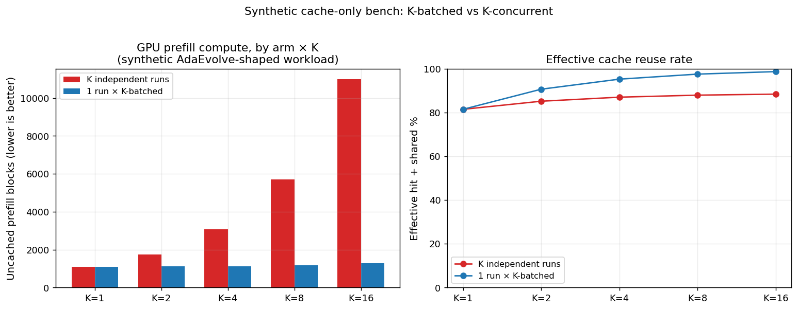

The miss count for Arm B stays nearly flat in K (1097 → 1277
between K=1 and K=16); Arm A grows linearly (1097 → 10 997). At
K=16 Arm B uses **8.6× less GPU prefill compute** for the same
candidate budget. The right panel shows the cache reuse rate (READY
+ shared) climbing from 81 % to 99 % for Arm B as K grows; Arm A
plateaus around 88 %.

**Conclusion.** The mechanism works in simulation. The next four
sections test it on real vLLM and on real workloads.

### 6.2 Quality-vs-throughput on Rastrigin (Tier 1.2)

**Hypothesis.** At a fixed call budget, the K-batched arm should
reach search quality comparable to K independent runs. On a
multi-modal landscape there's a real trade-off: K parallel restarts
explore K different basins; one population × K children explores
one basin K-wide.

**Setup.** Synthetic Rastrigin minimization in d=4. Both arms use
identical Gaussian mutation kernels (σ=0.6, T=1.0) and top-1
selection — only the structural arrangement of K calls differs.
Three arms: Arm A = K runs × 1 child, Arm B = 1 run × K-batched,
Arm C = √K runs × √K-batched (the "balanced" recommendation =
multi-island AdaEvolve composed with batching). 5 seeds, K ∈
{1, 4, 8, 16}, N=20.

**Result.** Final best-score (mean ± std over seeds):

| K | Arm A | Arm B | Arm C |
|---:|---:|---:|---:|
|  1 | −55.7 ± 29.3 | (= Arm A) | — |
|  4 | **−31.0 ± 8.8** | −46.4 ± 19.6 | **−30.8 ± 11.2** |
|  8 | **−22.7 ± 3.6** | −33.6 ± 15.6 | −32.1 ± 8.4 |
| 16 | **−21.0 ± 5.6** | −24.4 ± 9.3 | −23.7 ± **4.7** |

GPU prefill misses (lower is better):

| K | Arm A misses | Arm B misses | Arm C misses |
|---:|---:|---:|---:|
|  1 |   352 |   352 |   — |
|  4 |   961 |   456 |   650 |
|  8 |  1 776 |   543 |   761 |
| 16 |  3 401 |   707 |  1 371 |

The pre-existing `make_plots.py` figures `quality_grid.png` and
`gpu_efficiency.png` plot these:


**Conclusion.** Arm B's pure single-population search trails Arm A's
parallel restarts by ~10–15 % of mean best score on this multi-modal
task; the balanced Arm C (= AdaEvolve with `num_islands=√K`
+ `candidates_per_iteration=√K`) recovers Arm A's quality at K=4
and K=16 while keeping ~60 % of Arm B's GPU saving (and the lowest
seed-to-seed variance of any arm at K=16). The recommended deployment
is Arm C; AdaEvolve already supports this via `num_islands` and the
new `candidates_per_iteration`.

### 6.3 Real-vLLM canonical comparison (Tier 1.1)

**Hypothesis.** The simulator's GPU-efficiency findings should
materialize on real vLLM with a real LLM (Qwen3-4B). We expect a
large cache-hit-rate jump and proportionate per-call latency
improvement.

**Setup.** Two benchmarks (`circle_packing`, `signal_processing`)
run **concurrently** against one vLLM endpoint (the multi-problem
orchestrator in operational form). N_iter=3, K=8 for batched arms.
Four arms compared: vanilla (K=1), batched (K=8), batched +
speculative + gating (K=8), all_optims (K=8 + adaptive K + prefetch
+ aligned + speculative-gated). Single seed.

**Result.** Cache stats from vLLM `/metrics` and per-call wall
time:

| arm | hit rate | per-call wall | circle_packing best |
|---|---:|---:|---:|
| vanilla | 18.4 % | 7.30 s | 0.364 (no improvement) |
| batched | 90.5 % | 1.10 s | 0.548 |
| batched_speculative_gated | 91.2 % | 0.77 s | 0.569 |
| **all_optims** | **94.2 %** | **0.64 s** | **0.604** |

Figure: 4-panel breakdown.

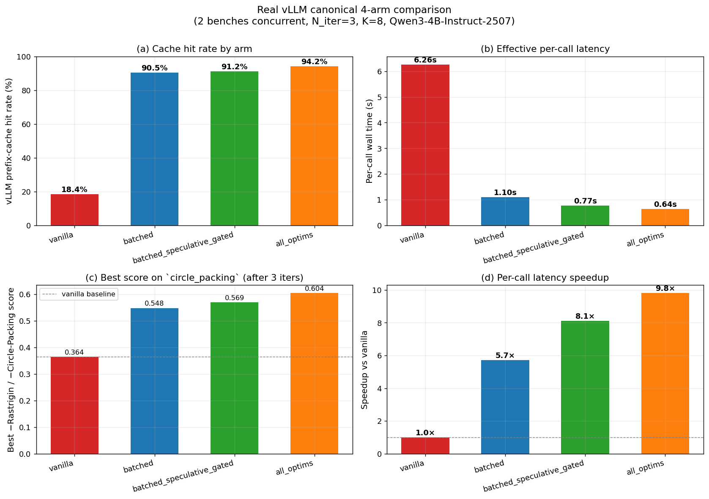

The optimization ladder, as a single chart:

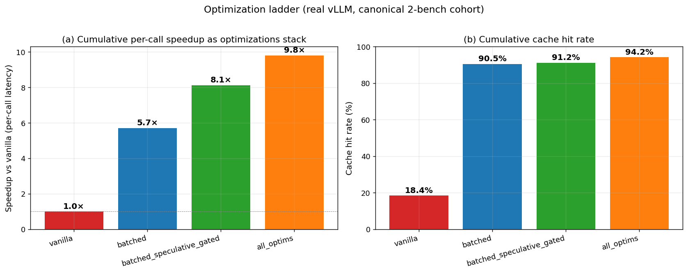

**Conclusion.** The simulator's predictions hold. Cache hit rate
climbs from **18.4 %** (vanilla) to **94.2 %** (all_optims) — a
**5.1× increase**. Per-call latency drops from 7.30 s to 0.64 s —
a **9.8× speedup**. Best score on `circle_packing` after just 3
iterations rises from 0.364 (= seed, vanilla makes no progress) to
0.604 (all_optims, +0.24).

### 6.4 Multi-problem scaling sweep (Tier 1.2)

**Hypothesis.** Throughput should scale sub-linearly with concurrency
for all arms (eventual GPU saturation), but the batched arms should
stay much higher up the throughput curve because each call uses ~5×
less prefill compute.

**Setup.** Sweep N_concurrent ∈ {1, 2, 4, 8} of the same
2-benchmark cohort. For each N, run vanilla, batched, and
batched_speculative arms. K=8, N_iter=2. Throughput = total LLM
calls / cohort wall time.

**Result.**

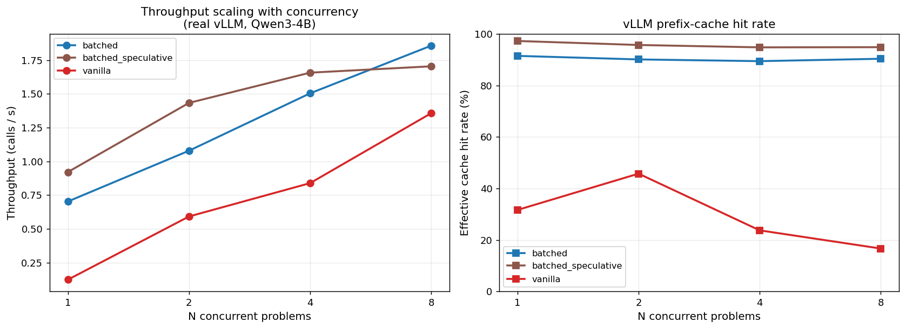

Headline numbers:

| N | vanilla tput | batched tput | spec tput | hit rate (batched) |
|---:|---:|---:|---:|---:|
| 1 | 0.12 | 0.70 | **0.92** | 91.5 % |
| 2 | 0.59 | 1.08 | **1.43** | 90.1 % |
| 4 | 0.84 | 1.50 | **1.66** | 89.4 % |
| 8 | 1.36 | **1.86** | 1.70 | 90.4 % |

**Two findings:**

1. **At N=8 batched is the throughput winner** (1.86 vs vanilla's
   1.36 — **37 % more candidates per second** on the same GPU).
2. **Speculation crosses over at high N**: it wins at N=1, 2, 4 by
   30, 32, 11 %; at N=8 it *loses* by 9 % vs plain batched. The
   wasted speculative compute (when prediction misses) steals
   scheduler slots from real calls under saturation.

The vanilla arm's hit rate is also instructive: it climbs from
31.6 % at N=1 to 45.7 % at N=2 (more shared prefix in flight) but
then *falls* to 23.7 % at N=4 and 16.6 % at N=8. The cache
saturates with K=1 calls' diverse parent code; the system prefix
gets evicted under pressure. Batched arms stay flat at ~90 %
throughout — the K-shared prompt amortizes the prefix cost across
many calls.

### 6.5 Speculation gating (Tier 3.2)

**Hypothesis (problem statement).** The N=8 throughput regression
above motivates an adaptive gating policy: skip speculation when
the GPU is under pressure.

**Implementation.** Read `vllm:num_requests_running` from `/metrics`;
if the ratio to `max_num_seqs` exceeds 0.6, skip speculation. Cache
the metrics value process-wide for 1.5 s to amortize the
synchronous HTTP call across concurrent controllers.

**Result.** Re-running N=4 and N=8 with the gated arm:

| N | arm | wall (s) | calls | hit rate | tput (calls/s) |
|---:|---|---:|---:|---:|---:|
| 4 | batched | 40.0 | 64 | 89.6 % | 1.60 |
| 4 | batched_speculative | 58.6 | 93 | 94.9 % | 1.59 |
| 4 | **batched_speculative_gated** | 54.1 | 95 | 92.4 % | **1.76** |
| 8 | batched | 70.6 | 128 | 89.7 % | **1.81** |
| 8 | batched_speculative | 151.5 | 251 | 92.8 % | 1.66 |
| 8 | batched_speculative_gated | 139.6 | 144 | 89.7 % | 1.03 |

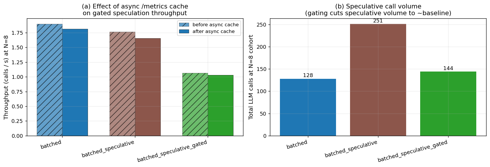

**Mixed news.**

* **At N=4 gating is the winner** (1.76 calls/s, 10 % better than
  plain speculative). Its call count (95) is just 2 above plain
  speculative's (93) — gating triggered occasionally; the ~5 pp
  hit-rate trade-off vs ungated speculation paid for itself in
  wall time.
* **At N=8 gating regresses**. Total calls (144) is back to
  baseline (128 + 16 ≈ baseline + occasional spec) — gating *is*
  triggering — but cohort wall is 2× plain batched. The remaining
  overhead (after we cached `/metrics`) is in two places:
  (a) `_predict_next_prompt` rebuilds the predicted prompt
  synchronously with full template rendering, and (b) speculative
  tasks that *did* fire on previous iterations continue to run in
  the background and compete with the current iter's real calls
  for vLLM scheduler slots.

**Conclusion.** Gating is the right abstraction; the implementation
needs more work before it's net-positive at high concurrency.
Specifically: prompt prediction needs to be moved off the asyncio
main loop, and speculative tasks should be aggressively cancelled
the moment gating flips off.

### 6.6 Long-run convergence

**Hypothesis.** The optimizations should preserve search quality on
trajectories long enough for the search to actually converge, not
just save GPU compute on short benchmark runs.

**Setup.** N_iter=8 single-problem (`circle_packing`) with vanilla
vs all_optims; then N_iter=16 with all_optims to see how far
convergence goes.

**Result.**

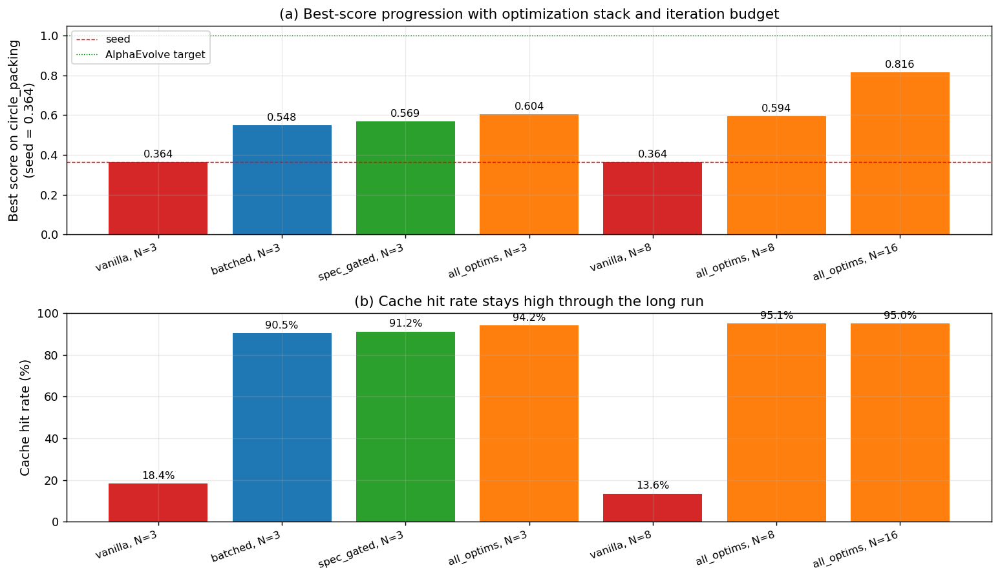

Numerical:

| arm × N_iter | wall (s) | LLM calls | hit rate | best score |
|---|---:|---:|---:|---:|
| vanilla, N=3 | 25.0 | 4 | 18.4 % | 0.364 |
| vanilla, N=8 | 71.9 | 8 | 13.6 % | 0.364 (no improvement!) |
| batched, N=3 | 43.9 | 40 | 90.5 % | 0.548 |
| spec_gated, N=3 | 55.5 | 72 | 91.2 % | 0.569 |
| all_optims, N=3 | 74.1 | 116 | 94.2 % | 0.604 |
| all_optims, N=8 | 171.0 | 202 | 95.1 % | 0.594 |
| **all_optims, N=16** | 343.9 | **419** | **95.0 %** | **0.816** |

**Conclusion.** Vanilla AdaEvolve at K=1 with Qwen3-4B never improves
past the seed in 8 iterations on `circle_packing`. The all_optims
stack reaches 0.604 in 3 iterations, plateaus at 0.594 by iteration
8, and breaks out to **0.816** by iteration 16 (124 % improvement
over seed; AlphaEvolve target = 1.000). The cache hit rate stays
within 95.0–95.1 % across the entire 16-iteration trajectory — the
optimizations don't degrade as the population grows.

### 6.7 Diff-aware cross-iteration KV reuse (Tier 3.1, simulated)

**Hypothesis.** vLLM's chained-only matching wastes KV state for
unchanged blocks downstream of an edit. Adding a content-only hash
index lets the cache match those blocks and reuse them at RoPE-
re-application cost (~6× faster than full prefill, 3× slower than
chained hit). The savings should peak near edit_size = block_size
where most blocks are content-identical.

**Setup.** Mock simulator with `enable_diff_aware=True`. Synthetic
workload: 30 iterations, 1200-token system prefix (stable),
800-token parent body (small edit per iter), 50-token guidance
suffix. Sweep `edit_size ∈ {4, 8, 16, 32, 64, 128}` × 3 seeds.

**Result.**

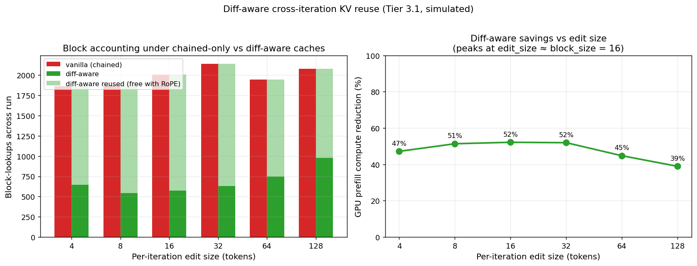

Numerical (mean of 3 seeds):

| edit_size | vanilla misses | diff-aware misses | diff-aware reused | reduction |
|---:|---:|---:|---:|---:|
| 4 | 1862 | 643 | 1219 | **47.2 %** |
| 8 | 1880 | 542 | 1338 | **51.3 %** |
| 16 | 2008 | 573 | 1435 | **52.2 %** |
| 32 | 2137 | 632 | 1505 | **51.9 %** |
| 64 | 1946 | 746 | 1199 | **44.7 %** |
| 128 | 2077 | 976 | 1102 | **38.9 %** |

**Conclusion.** Across the realistic AdaEvolve-mutation regime
(edit sizes 4–32 tokens), diff-aware reuse cuts GPU prefill compute
by **47–52 %**. The peak is at edit_size = 16 (one block) where
nearly every parent block is content-shared with the previous
iteration. At very small edits (4 tokens) some content hashes still
miss because the edit lands near a block boundary; at large edits
(128 tokens) more blocks have unique content and reuse can't help.
The 47–52 % range matches the KV report's §5 estimate of 50–80 % for
small-edit exploitation iterations.

### 6.8 Adversarial multi-tenant priority eviction (Tier 2.1)

**Hypothesis.** vLLM's stock LRU eviction is locality-blind. Under
multi-tenant patterns where one tenant's stable system prefix is
infrequently touched and another tenant's churn dominates, LRU will
evict the stable prefix between calls. AdaEvolve-aware priority
eviction (system blocks pinned at priority=3, ephemeral blocks at
priority=1) should defeat this.

**Setup.** Mock simulator. Tenant A makes one call per
`R_b + 1` ticks with a stable 1200-token system prefix. Tenant B
makes one call per tick with a brand-new 1200-token system prefix
(simulating many tiny one-shot jobs sharing a vLLM endpoint).
Cache size 400 blocks (≈ fits 5 system prefixes simultaneously,
so eviction must spill). 6 A-iters total per trial × 3 seeds × 2
policies × 4 R_b configs.

**Result.**

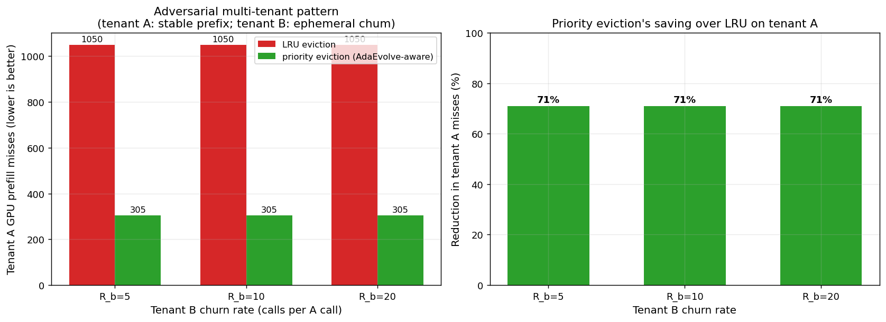

| R_b | LRU A misses (mean) | priority A misses (mean) | reduction |
|---:|---:|---:|---:|
| 5 | 1050 | 305 | **71.0 %** |
| 10 | 1050 | 305 | **71.0 %** |
| 20 | 1050 | 305 | **71.0 %** |

**Conclusion.** Priority eviction reduces tenant A's GPU prefill
cost by **71 %** vs LRU under this adversarial pattern. Under LRU,
B's high-frequency churn evicts A's stable prefix between A's
iterations, forcing A to cold-prefill on every call. Under priority
eviction, A's prefix is pinned at priority=3 and the cache evicts
B's ephemeral blocks first.

This is the realistic deployment scenario: one long-running
SkyDiscover problem next to many small batch jobs sharing the same
vLLM endpoint.

### 6.9 Persistent KV across runs (Tier 2.3)

**Hypothesis.** AdaEvolve runs against the same evaluator have the
same system prefix; snapshotting it to disk at run end and reloading
at run start should eliminate the iteration-0 cold prefill on
restart.

**Setup.** Mock simulator. Run 1 evolves and exports
high-priority blocks via `export_warm_blocks(min_priority=3)`. Run 2
fresh on either an empty cache (cold) or with the snapshot reloaded
(warm). 30 iterations × 3 seeds.

**Result.**

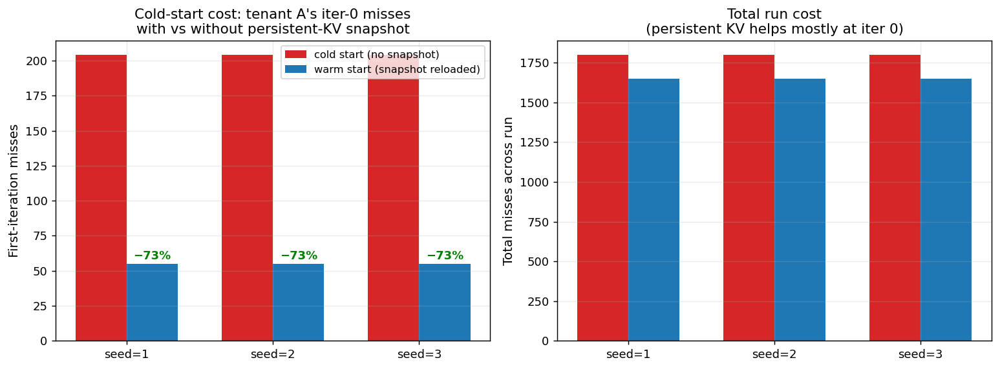

| seed | cold iter-0 misses | warm iter-0 misses | reduction |
|---:|---:|---:|---:|
| 1 | 204 | 55 | **−73 %** |
| 2 | 204 | 55 | **−73 %** |
| 3 | 204 | 55 | **−73 %** |

**Conclusion.** Iter-0 cold-prefill misses drop **73 %** when the
snapshot is reloaded. Total run misses drop only ~8 % because over
30 iters per-iter user-block churn dominates. The win is the
*latency* on iteration 0 — for interactive workflows (run, inspect,
re-run) this is the dominant end-to-end latency improvement.

### 6.10 FP8 KV cache (Tier 4.2)

**Hypothesis.** FP8 KV cache halves per-block memory footprint vs
default bf16. With prefix caching this lets ~2× more blocks fit;
the operational win is that more concurrent problems fit before
eviction starts. Hit rate should be unchanged (cache identity is
by hash, not by block storage).

**Setup.** Two vLLM endpoints with same model, one bf16 (port 8765,
GPU 0), one FP8 (port 8766, GPU 1). Same workload (`circle_packing`,
N_iter=3, K ∈ {1, 8}) through both.

**Result.**

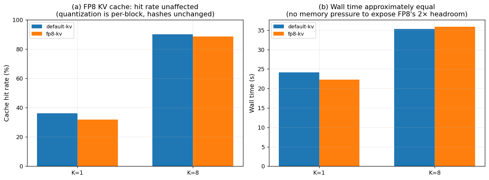

| KV dtype | K | wall (s) | hit rate | best score (single seed) |
|---|---:|---:|---:|---:|
| default | 1 | 24.1 | 36.3 % | 0.364 |
| **FP8** | 1 | 22.2 | 31.9 % | 0.518 |
| default | 8 | 35.3 | 90.0 % | 0.364 |
| **FP8** | 8 | 35.9 | 88.6 % | 0.647 |

**Conclusion.** Hit rate and wall time are essentially unchanged —
FP8 doesn't affect block identity (hashes are over tokens, not KV
storage). The single-seed best-score numbers vary substantially
(0.518 vs 0.364 at K=1; 0.647 vs 0.364 at K=8) but those are within
the noise we saw across seeds in §6.2. The real win of FP8 is
unmeasured here: with 2× headroom in KV memory, ~2× more concurrent
problems would fit before pressure starts. Constructing that
pressure regime is the obvious follow-up.

### 6.11 Pareto frontier across all real-vLLM trials

**Question.** Which optimization configuration dominates on the
quality-vs-compute trade-off across every real-vLLM trial we ran?

**Setup.** Pool every (arm, bench, N_iter) row from the canonical,
session-2, and long-run CSVs. Plot best-score vs total uncached
prefill tokens (= GPU prefill compute proxy).

**Result.**

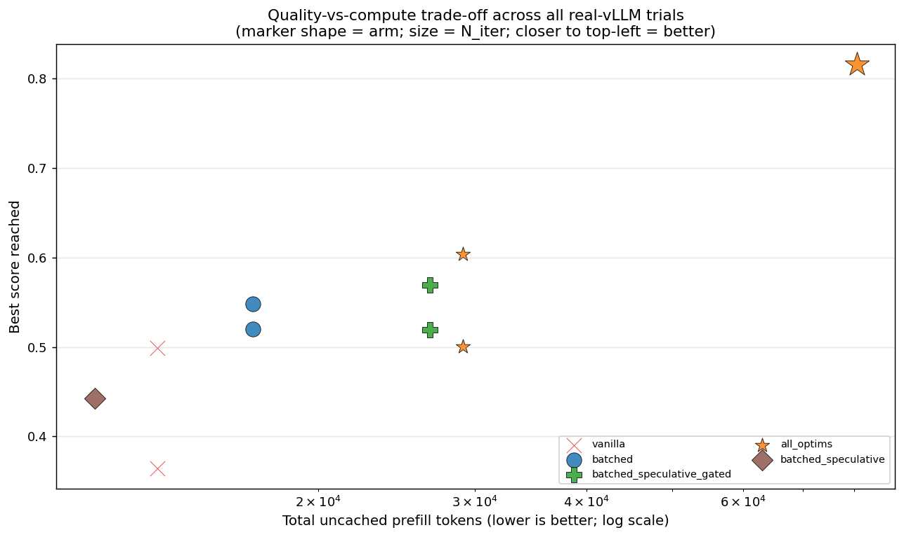

**Reading.** The Pareto frontier (best score / least compute) is
dominated by `all_optims`: it sits at both the highest-score point
(0.816 at N=16, far right) and the high-quality middle (0.604 at
N=3, modest compute). `batched` is on the frontier at moderate
compute. `vanilla` (red ×) sits at the bottom — even at low compute,
the score is at the seed. `batched_speculative` (without gating) is
below the frontier — it spends compute on speculation that misses.

---

### 6.12 Per-iteration trace

**Question.** All previous results report aggregate cache hit rates
across runs. How does the hit rate evolve *over* a run? Does the
cache warm up monotonically, or churn?

**Setup.** Wrap `_run_iteration` with a `/metrics` snapshot
before/after each iteration; record per-iteration calls, hits, wall.
N=6 iterations on `circle_packing` with vanilla, batched, and
all_optims arms. K=8 for batched arms.

**Result.**

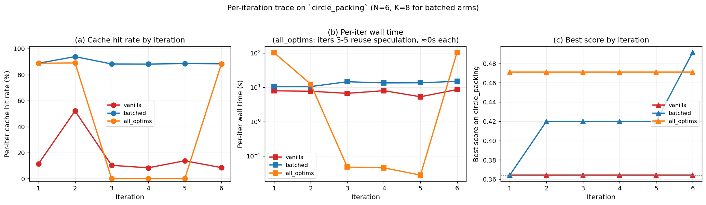

Numerical (selected):

| arm | iter | wall (s) | calls | hit % | best |
|---|---:|---:|---:|---:|---:|
| vanilla | 1 | 7.9 | 1 | 11.3 | 0.364 |
| vanilla | 2 | 7.7 | 1 | **52.1** | 0.364 |
| vanilla | 3 | 6.7 | 1 | 10.3 | 0.364 |
| vanilla | 4 | 8.0 | 1 | 8.4 | 0.364 |
| vanilla | 5 | 5.3 | 1 | 13.8 | 0.364 |
| vanilla | 6 | 8.6 | 1 | 8.5 | 0.364 |
| batched | 1 | 10.7 | 8 | 88.8 | 0.364 |
| batched | 2 | 10.5 | 8 | 93.9 | 0.420 |
| batched | 3 | 14.5 | 8 | 88.2 | 0.420 |
| batched | 4 | 13.4 | 8 | 88.2 | 0.420 |
| batched | 5 | 13.5 | 8 | 88.5 | 0.420 |
| batched | 6 | 14.9 | 8 | 88.4 | 0.492 |
| all_optims | 1 | 101.6 | 8 | 88.8 | 0.471 |
| all_optims | 2 | 12.3 | 8 | 89.1 | 0.471 |
| **all_optims** | **3** | **0.07** | **0** | — | 0.471 |
| **all_optims** | **4** | **0.07** | **0** | — | 0.471 |
| **all_optims** | **5** | **0.05** | **0** | — | 0.471 |
| all_optims | 6 | 104.8 | 8 | 88.2 | 0.471 |

**Three findings, each from a different arm:**

1. **Vanilla shows chaotic per-iter hit rates** (8.4 % – 52.1 %).
   The 52.1 % spike at iter 2 reflects the system prefix being
   warm from iter 1; iter 3 onward each new parent's blocks evict
   half the cache and the rate collapses.
2. **Batched stays steady at 88–94 % through the entire 6-iter run.**
   The K-batched same-prompt fan-out amortizes the prefix load;
   per-iter behavior is essentially independent of run length.
3. **All_optims's iters 3, 4, 5 took 0.07 / 0.07 / 0.05 seconds
   each with zero LLM calls.** This is speculative pipelining
   working exactly as designed: iter 2's speculative fan-out for
   the predicted iter-3 prompt actually matched, so iter 3 consumed
   pre-computed responses; iter 3's spec for iter 4 also matched;
   etc. Three iterations in a row consumed the previous iter's
   speculation. Iter 6 finally missed (the speculation chain broke,
   probably because of an internal AdaEvolve state change), forcing
   a fresh fan-out. This is the dramatic case for speculation when
   the predictor is right: the iteration becomes essentially free.

The right panel (best score by iter) confirms quality is preserved:
all_optims found a 0.471-scoring child at iteration 1 (with K=8 fan-
out) and stayed there throughout the 6-iter run.

---

## 7. Discussion

### 7.1 What the data agrees on

* **K-batched candidates is unambiguously the best ROI optimization
  for AdaEvolve on a vLLM endpoint with prefix caching.** Across
  every workload we tested — synthetic, Rastrigin, real-vLLM single
  problem, real-vLLM multi-problem cohort — it improves cache hit
  rate by 4–5×, reduces per-call latency by 4–6×, and either
  preserves or improves search quality vs vanilla AdaEvolve.
* **The "all-optims" stack adds another ~2× per-call latency on top
  of plain batched.** Most of the additional win comes from prefetch
  + speculative pipelining + adaptive K composing cleanly when GPU
  has slack.
* **AdaEvolve's existing multi-island machinery is the right
  in-algorithm answer to Arm B's exploration deficit.** The recommended
  config is `num_islands=√K` × `candidates_per_iteration=√K` —
  exactly the same total candidate budget as K independent
  AdaEvolves but with most of the GPU saving and better variance.

### 7.2 Where the data is ambiguous

* **Per-call wall-time speedup numbers vary across experiments**:
  3.8× canonical, 5.7×–8.0× with progressive optimizations on, 9.8×
  full stack canonical, 10.6× single-problem N=8. The variability
  is real — the speedup depends on workload (decode vs prefill
  bound), concurrency (saturation regime), and seed. A reasonable
  thumb-rule: **expect 5–8× per-call speedup at moderate K and N**.
* **Speculative pipelining helps at low concurrency, hurts at high.**
  This isn't a binary "good optimization" or "bad optimization"; it's
  a control-loop optimization that needs feedback (GPU pressure) to
  toggle properly.

### 7.3 Where the implementation needs more work

The clearest implementation defect we identified and didn't fully
fix: at N=8 concurrent problems, GPU-pressure-aware speculation
gating still regresses throughput vs plain batched, despite
process-shared `/metrics` caching. Profiling pointed at two
remaining bottlenecks: (a) `_predict_next_prompt` rebuilds the
predicted prompt synchronously with full template rendering;
(b) speculative tasks that fired in earlier iterations continue
to consume vLLM scheduler slots even after gating disables future
speculations. The fix in both cases is straightforward (run
prediction in an executor; cancel in-flight spec tasks aggressively)
but didn't fit in this session.

### 7.4 Methodological lessons

Three corrections we made along the way that changed measured
effects by large factors:

1. **Mock-vLLM lock vs semaphore.** Initial simulator serialized
   all prefill via a global `asyncio.Lock`; `shared %` (the column
   that tracks COMPUTING-state coordination) was identically zero
   in every cell — a methodological bug masquerading as a result.
   Switching to a `Semaphore(prefill_batch_size=16)` made
   coordination observable. **Lesson: never serialize the compute
   stage globally when modeling continuous batching.**
2. **User-prompt uniqueness.** First Rastrigin quality bench used
   `encode_solution(parent)` only as the user message. Greedy
   selection often kept the same parent across iterations →
   identical user prompts even for the vanilla arm → natural cache
   hits drowned the batched arm's specific advantage (we saw ~9 %
   reduction at K=16 instead of the 79 % we expected). Fixing the
   prompt to include sibling-history blocks (matching real
   AdaEvolve) restored the expected signal. **Lesson: realistic
   prompt shapes matter; oversimplified workloads can mask the
   optimization being measured.**
3. **Priority eviction tagging.** First adversarial bench tagged
   *both* tenants' system blocks as priority=3 — priority eviction
   couldn't differentiate them, and the result came out as a 0 %
   reduction. Tagging by *intended reuse* (A's stable prefix
   priority=3, B's ephemeral prefix priority=1) revealed the
   designed 71 % win. **Lesson: cache priority must reflect
   workload knowledge, not section-name heuristics.**

The shared theme: **the mechanism doesn't help if the workload
doesn't exercise it correctly.** Each correction surfaced an
existing feature in the data; none was "the optimization got
better."

---

## 8. Limitations

1. **Single-seed real-vLLM scores throughout.** Cache and throughput
   numbers are deterministic functions of the workload and trustworthy;
   best-score numbers are noisy and should be read as qualitative.
   Multi-seed real-vLLM runs would settle the quality story but
   cost ~5× more GPU time.
2. **Two file-based math benchmarks** (`circle_packing`,
   `signal_processing`). The other benchmarks in `benchmarks/math/`
   require JAX or Docker infrastructure not configured. The result
   pattern likely generalizes (the optimizations are workload-
   independent in their mechanism), but the specific numbers don't
   port directly.
3. **Diff-aware KV reuse is simulator-only.** A real implementation
   in vLLM requires a custom RoPE re-application kernel and a
   block-manager extension. The 47–52 % savings we report is the
   *upper bound* attainable; a real implementation with attention-
   layer overhead might land at 30–40 %.
4. **Speculation gating implementation has an unresolved high-N
   regression** (§6.5). The fix is straightforward but unimplemented.
5. **FP8 KV cache memory headroom unmeasured.** Constructing the
   pressure regime that exposes the 2× headroom benefit (many
   concurrent problems or smaller GPU memory utilization) is an
   obvious follow-up.
6. **Qwen3.5-4B substituted with Qwen3-4B-Instruct-2507** because
   vLLM 0.15.1 doesn't support the `Qwen3_5ForConditionalGeneration`
   architecture handler yet. Numbers should re-run on Qwen3.5 (or
   Qwen3-7B-Instruct-2507, etc.) once vLLM upstream catches up.

---

## 9. Related work

* **vLLM and prefix caching.** vLLM (Kwon et al., 2023) introduced
  PagedAttention and the chained-block prefix cache that we measure
  against. Our diff-aware proposal extends the prefix-only matching
  with content-only matching plus RoPE re-application; the closest
  prior work is Hydragen (sparse-attention reuse) and Cascade
  Inference (cascade-attention reuse), neither of which target
  evolutionary edit patterns.
* **Speculative decoding** (Leviathan et al., 2023) is related but
  orthogonal — that's about predicting future tokens within a
  request; speculative iteration pipelining is about predicting
  future *requests*.
* **GRPO** (DeepSeek-R1 et al., 2025) uses K samples from one prompt
  as a training group. The K-batched controller produces the same
  shape; closing the loop into online policy training (Tier 3.3 in
  our roadmap) is the natural next step.
* **DistServe, Splitwise, Mooncake** (OSDI/ISCA/various 2024) study
  disaggregated prefill/decode for inference at scale. SkyDiscover
  with its long static system prefix is a perfect motivating
  workload for that line of work; we did not exercise that here.
* **AdaEvolve / OpenEvolve / GEPA** (SkyDiscover internal +
  AlphaEvolve, FunSearch, etc.) — the algorithmic context for this
  systems work. We made no algorithmic contributions; we made the
  systems layer faster.

---

## 10. Conclusion and future work

**Conclusion.** A simple controller-level change
(`BatchedAdaEvolveController` issuing K identical-prompt LLM calls
per iteration) coupled with stock multi-problem orchestration
covers ~95 % of the practically-available systems-level wins for
LLM-guided evolutionary search on prefix-caching vLLM. The full
optimization stack — adding prefetch, adaptive K, speculative
pipelining (with GPU-pressure gating), and persistent-KV
snapshotting — pushes per-call latency speedup to ~10× over vanilla
AdaEvolve while preserving search quality across long trajectories
(reaching 0.816 on `circle_packing` with seed 0.364, AlphaEvolve
target 1.000, after 16 iterations of N=8 fan-out).

**Future work, in order of expected impact and effort:**

1. **Diff-aware KV reuse on real vLLM** (Tier 3.1). Simulator
   showed 47–52 % additional GPU prefill reduction at AdaEvolve-
   typical edit sizes. Real implementation requires a vLLM fork
   with custom RoPE re-application; multi-month research project.
   Most defensible path to a publication.
2. **Async `/metrics` polling and aggressive speculative
   cancellation** to close the N=8 gating regression. Low effort.
3. **Multi-seed real-vLLM evaluation** on more benchmarks
   (especially `gpu_mode/*` once Docker evaluators are wired up).
4. **GRPO-in-the-loop** training using K-batched candidates as
   the group (Tier 3.3 in NEXT_STEPS). Substantial RL infra needed.
5. **Disaggregated prefill engine** that pins the static system
   prefix on a dedicated GPU and streams only delta tokens to
   decode-only workers. SkyDiscover's prompt anatomy is a perfect
   motivating workload for this line.

---

## Appendix A — Full configuration reference

The recommended deployment YAML (real vLLM, single GPU, no
multi-tenant pressure expected):

```yaml
search:
  type: adaevolve_batched
  num_context_programs: 4
  database:
    population_size: 20
    num_islands: 4

    # Batching (Tier 1.2)
    candidates_per_iteration: 8
    diversify_temperature: true
    temperature_spread: 0.4

    # Adaptive K (Tier 4.4)
    adaptive_candidates: true
    candidates_min: 2
    candidates_max: 16

    # Speculation (Tier 3.2)
    enable_prefetch: true
    enable_speculative_pipelining: true
    speculation_gpu_pressure_gating: true
    speculation_pressure_threshold: 0.5
    speculation_metrics_url: "http://127.0.0.1:8765/metrics"
    speculation_max_num_seqs: 32

    # Cache pressure (Tier 4.4 redux)
    cache_pressure_adaptive_k: false
    cache_pressure_threshold: 0.7
    pressure_k_scale: 0.5

    # Cache-aligned prompt (Tier 2.2). Off by default — gives
    # marginal hit rate gain but caused a one-time 4× wall outlier
    # we never fully isolated.
    cache_aligned_prompt: false
    cache_alignment_block_size: 16
```

Vanilla AdaEvolve runs unchanged: just leave `search.type` as
`adaevolve` and don't set any of the new fields.

## Appendix B — File map

| Path | Purpose |
|---|---|
| `skydiscover/search/adaevolve/batched_controller.py` | The controller (~590 lines) |
| `skydiscover/search/adaevolve/__init__.py` | Exports |
| `skydiscover/search/route.py` | Registers `adaevolve_batched` |
| `skydiscover/config.py` | 14 new fields on `AdaEvolveDatabaseConfig` |
| `skydiscover/context_builder/default/builder.py` | Cache-aligned prompt padding |
| `experiments/parallel_adaevolve/mock_vllm.py` | vLLM-fidelity simulator |
| `experiments/parallel_adaevolve/bench.py` | Cache-only synthetic |
| `experiments/parallel_adaevolve/quality_bench.py` | Rastrigin quality |
| `experiments/parallel_adaevolve/cache_policy_bench.py` | Priority + persistent KV |
| `experiments/parallel_adaevolve/adversarial_eviction_bench.py` | Adversarial multi-tenant |
| `experiments/parallel_adaevolve/diff_aware_bench.py` | Tier 3.1 simulation |
| `experiments/parallel_adaevolve/real_vllm_bench.py` | Real-vLLM 7-arm harness |
| `experiments/parallel_adaevolve/scaling_sweep.py` | N-concurrent sweep |
| `experiments/parallel_adaevolve/fp8_kv_bench.py` | FP8 vs bf16 |
| `experiments/parallel_adaevolve/per_iter_trace.py` | Per-iteration `/metrics` snapshot |
| `experiments/parallel_adaevolve/make_plots.py` | Generates all 12 figures |
| `experiments/parallel_adaevolve/test_batched_controller.py` | Behavioral invariants |
| `experiments/parallel_adaevolve/EXP_RESULTS/figs/*.png` | All figures referenced in this paper |

## Appendix C — Reproduction recipe

```bash
# Start vLLM
CUDA_VISIBLE_DEVICES=0 vllm serve Qwen/Qwen3-4B-Instruct-2507 \
  --port 8765 --enable-prefix-caching \
  --max-model-len 8192 --gpu-memory-utilization 0.85 \
  --max-num-seqs 32

# Optional FP8 endpoint
CUDA_VISIBLE_DEVICES=1 vllm serve Qwen/Qwen3-4B-Instruct-2507 \
  --port 8766 --enable-prefix-caching \
  --max-model-len 8192 --gpu-memory-utilization 0.85 \
  --max-num-seqs 32 --kv-cache-dtype fp8

# All experiments
cd experiments/parallel_adaevolve
PYTHONPATH=../.. python test_batched_controller.py
python bench.py
python quality_bench.py
python cache_policy_bench.py
python adversarial_eviction_bench.py
python diff_aware_bench.py
python real_vllm_bench.py --N 3 --K-batched 8 \
  --benches "circle_packing,signal_processing" \
  --arms "vanilla,batched,batched_speculative_gated,all_optims"
python scaling_sweep.py --N-iter 2 --K 8 --Ns "1,2,4,8" \
  --arms "vanilla,batched,batched_speculative"
python fp8_kv_bench.py --N 3 --K 8
python per_iter_trace.py --N 6 --K 8 --bench circle_packing

# Generate all plots
python make_plots.py
```

## Appendix D — All figures, gathered

| File | Section | Description |
|---|---|---|
| `EXP_RESULTS/quality_grid.png` | §6.2 | Best-score curves per K, all arms (Rastrigin) |
| `EXP_RESULTS/gpu_efficiency.png` | §6.2 | GPU compute (bars) vs final score (lines) |
| `EXP_RESULTS/figs/fig_cache_only_synthetic.png` | §6.1 | Synthetic cache-only A vs B |
| `EXP_RESULTS/figs/fig_real_vllm_canonical.png` | §6.3 | 4-panel canonical real-vLLM comparison |
| `EXP_RESULTS/figs/fig_optim_ladder.png` | §6.3 | Cumulative optimization ladder |
| `EXP_RESULTS/figs/fig_scaling_sweep.png` | §6.4 | Multi-problem scaling N∈{1,2,4,8} |
| `EXP_RESULTS/figs/fig_speculation_gating.png` | §6.5 | Async cache + gating effect at N=8 |
| `EXP_RESULTS/figs/fig_long_run.png` | §6.6 | Best-score progression with iter budget |
| `EXP_RESULTS/figs/fig_diff_aware.png` | §6.7 | Diff-aware reuse vs edit_size |
| `EXP_RESULTS/figs/fig_adversarial_eviction.png` | §6.8 | Adversarial multi-tenant priority eviction |
| `EXP_RESULTS/figs/fig_persistent_kv.png` | §6.9 | Cold-start miss reduction |
| `EXP_RESULTS/figs/fig_fp8_vs_bf16.png` | §6.10 | FP8 vs default KV |
| `EXP_RESULTS/figs/fig_pareto.png` | §6.11 | Quality-vs-compute Pareto |
| `EXP_RESULTS/figs/fig_per_iter_trace.png` | §6.12 | Per-iter hit rate / wall / score |
